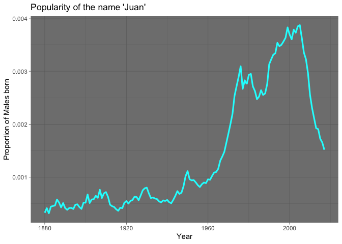

Transform Data
================

# dplyr

## Your Turn 1

Alter the code to select just the `n` column:

``` r
select(babynames, n)
```

    # A tibble: 1,924,665 × 1
           n
       <int>
     1  7065
     2  2604
     3  2003
     4  1939
     5  1746
     6  1578
     7  1472
     8  1414
     9  1320
    10  1288
    # … with 1,924,655 more rows

## Quiz

Which of these is NOT a way to select the `name` and `n` columns
together?

``` r
select(babynames, -c(year, sex, prop))
```

    # A tibble: 1,924,665 × 2
       name          n
       <chr>     <int>
     1 Mary       7065
     2 Anna       2604
     3 Emma       2003
     4 Elizabeth  1939
     5 Minnie     1746
     6 Margaret   1578
     7 Ida        1472
     8 Alice      1414
     9 Bertha     1320
    10 Sarah      1288
    # … with 1,924,655 more rows

``` r
select(babynames, name:n)
```

    # A tibble: 1,924,665 × 2
       name          n
       <chr>     <int>
     1 Mary       7065
     2 Anna       2604
     3 Emma       2003
     4 Elizabeth  1939
     5 Minnie     1746
     6 Margaret   1578
     7 Ida        1472
     8 Alice      1414
     9 Bertha     1320
    10 Sarah      1288
    # … with 1,924,655 more rows

``` r
select(babynames, starts_with("n"))
```

    # A tibble: 1,924,665 × 2
       name          n
       <chr>     <int>
     1 Mary       7065
     2 Anna       2604
     3 Emma       2003
     4 Elizabeth  1939
     5 Minnie     1746
     6 Margaret   1578
     7 Ida        1472
     8 Alice      1414
     9 Bertha     1320
    10 Sarah      1288
    # … with 1,924,655 more rows

``` r
select(babynames, ends_with("n"))
```

    # A tibble: 1,924,665 × 1
           n
       <int>
     1  7065
     2  2604
     3  2003
     4  1939
     5  1746
     6  1578
     7  1472
     8  1414
     9  1320
    10  1288
    # … with 1,924,655 more rows

## Your Turn 2

Use `filter`, `babynames`, and the logical operators to find:

-   All of the names where prop is greater than or equal to 0.08  
-   All of the children named “Sea”

``` r
filter(babynames, prop >= 0.08)
```

    # A tibble: 3 × 5
       year sex   name        n   prop
      <dbl> <chr> <chr>   <int>  <dbl>
    1  1880 M     John     9655 0.0815
    2  1880 M     William  9532 0.0805
    3  1881 M     John     8769 0.0810

``` r
filter(babynames, name == "Sea")
```

    # A tibble: 4 × 5
       year sex   name      n       prop
      <dbl> <chr> <chr> <int>      <dbl>
    1  1982 F     Sea       5 0.00000276
    2  1985 M     Sea       6 0.00000312
    3  1986 M     Sea       5 0.0000026 
    4  1998 F     Sea       5 0.00000258

## Your Turn 3

Use Boolean operators to return only the rows that contain:

-   *Boys* named Sue  
-   Names that were used by exactly 5 or 6 children in 1880  
-   Names that are one of Acura, Lexus, or Yugo

``` r
filter(babynames, sex == "M", name == "Sue")
```

    # A tibble: 52 × 5
        year sex   name      n       prop
       <dbl> <chr> <chr> <int>      <dbl>
     1  1917 M     Sue       7 0.0000073 
     2  1927 M     Sue       5 0.0000043 
     3  1928 M     Sue       5 0.00000438
     4  1930 M     Sue       5 0.00000443
     5  1931 M     Sue       6 0.00000561
     6  1932 M     Sue       7 0.00000652
     7  1933 M     Sue       7 0.00000686
     8  1934 M     Sue      14 0.0000132 
     9  1935 M     Sue      13 0.0000122 
    10  1936 M     Sue       9 0.00000846
    # … with 42 more rows

``` r
filter(babynames, n == 5 | n == 6, year == "1880")
```

    # A tibble: 455 × 5
        year sex   name        n      prop
       <dbl> <chr> <chr>   <int>     <dbl>
     1  1880 F     Abby        6 0.0000615
     2  1880 F     Aileen      6 0.0000615
     3  1880 F     Alba        6 0.0000615
     4  1880 F     Alda        6 0.0000615
     5  1880 F     Alla        6 0.0000615
     6  1880 F     Alverta     6 0.0000615
     7  1880 F     Ara         6 0.0000615
     8  1880 F     Ardelia     6 0.0000615
     9  1880 F     Ardella     6 0.0000615
    10  1880 F     Arrie       6 0.0000615
    # … with 445 more rows

``` r
filter(babynames, name %in% c("Acura", "Lexus", "Yugo"))
```

    # A tibble: 57 × 5
        year sex   name      n       prop
       <dbl> <chr> <chr> <int>      <dbl>
     1  1990 F     Lexus    36 0.0000175 
     2  1990 M     Lexus    12 0.00000558
     3  1991 F     Lexus   102 0.0000502 
     4  1991 M     Lexus    16 0.00000755
     5  1992 F     Lexus   193 0.0000963 
     6  1992 M     Lexus    25 0.0000119 
     7  1993 F     Lexus   285 0.000145  
     8  1993 M     Lexus    30 0.0000145 
     9  1994 F     Lexus   381 0.000195  
    10  1994 F     Acura     6 0.00000308
    # … with 47 more rows

## Help Me

What is the smallest value of n? What is the largest?

``` r
arrange(babynames, desc(n)) #Largest is 99686
```

    # A tibble: 1,924,665 × 5
        year sex   name        n   prop
       <dbl> <chr> <chr>   <int>  <dbl>
     1  1947 F     Linda   99686 0.0548
     2  1948 F     Linda   96209 0.0552
     3  1947 M     James   94756 0.0510
     4  1957 M     Michael 92695 0.0424
     5  1947 M     Robert  91642 0.0493
     6  1949 F     Linda   91016 0.0518
     7  1956 M     Michael 90620 0.0423
     8  1958 M     Michael 90520 0.0420
     9  1948 M     James   88588 0.0497
    10  1954 M     Michael 88514 0.0428
    # … with 1,924,655 more rows

``` r
arrange(babynames, n) #Smallest is 5
```

    # A tibble: 1,924,665 × 5
        year sex   name          n      prop
       <dbl> <chr> <chr>     <int>     <dbl>
     1  1880 F     Adelle        5 0.0000512
     2  1880 F     Adina         5 0.0000512
     3  1880 F     Adrienne      5 0.0000512
     4  1880 F     Albertine     5 0.0000512
     5  1880 F     Alys          5 0.0000512
     6  1880 F     Ana           5 0.0000512
     7  1880 F     Araminta      5 0.0000512
     8  1880 F     Arthur        5 0.0000512
     9  1880 F     Birtha        5 0.0000512
    10  1880 F     Bulah         5 0.0000512
    # … with 1,924,655 more rows

## Your Turn 4

Use `%>%` to write a sequence of functions that:

1.  Filters babynames to just the girls that were born in 2017,
    *then…*  
2.  Selects the `name` and `n` columns, *then…*  
3.  Arranges the results so that the most popular names are near the
    top.

``` r
girls_2017 <- babynames %>% filter(sex == "F", year == "2017") %>% select(name, n) %>% arrange(desc(n))
#Emma was the most popular female name in 2017, with 19738 children given the name!
```

## Your Turn 5

1.  Trim `babynames` to just the rows that contain **your** `name` and
    **your** `sex`  
2.  Trim the result to just the columns that will appear in your graph
    (not strictly necessary, but useful practice)  
3.  Plot the results as a line graph with `year` on the x axis and
    `prop` on the y axis

``` r
babynames %>% 
  filter(sex == "M", name == "Juan") %>% 
  select(year, prop) %>% 
  ggplot(aes(x = year, y = prop)) +
  geom_line(color = "cyan", size = 1.12) +
  labs(title = "Popularity of the name 'Juan'", x = "Year", y = "Proportion of Males born") +
  theme_dark()
```

<!-- -->

------------------------------------------------------------------------

# Take aways

-   Extract variables with `select()`  
-   Extract cases with `filter()`  
-   Arrange cases, with `arrange()`
